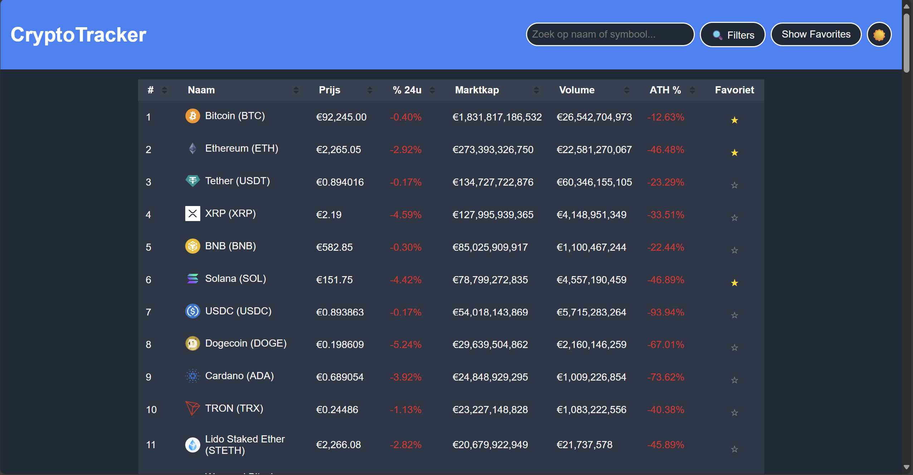
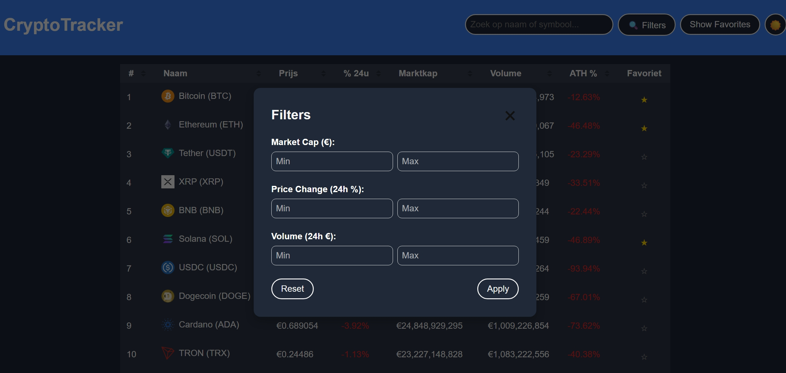
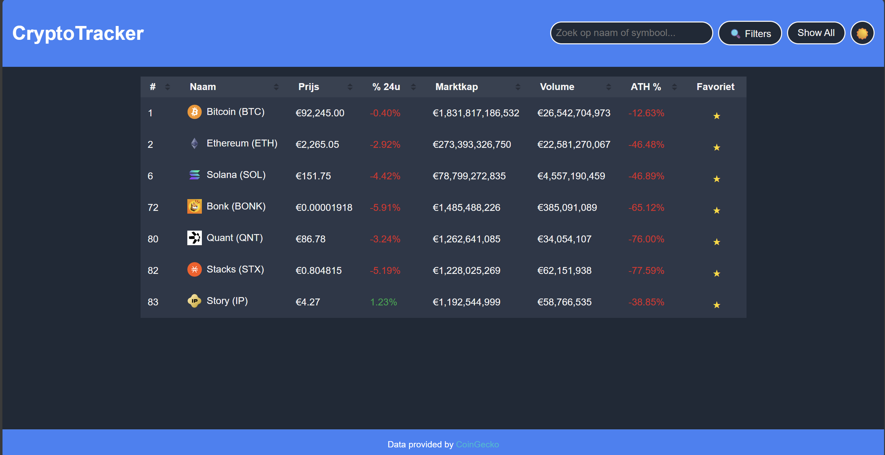
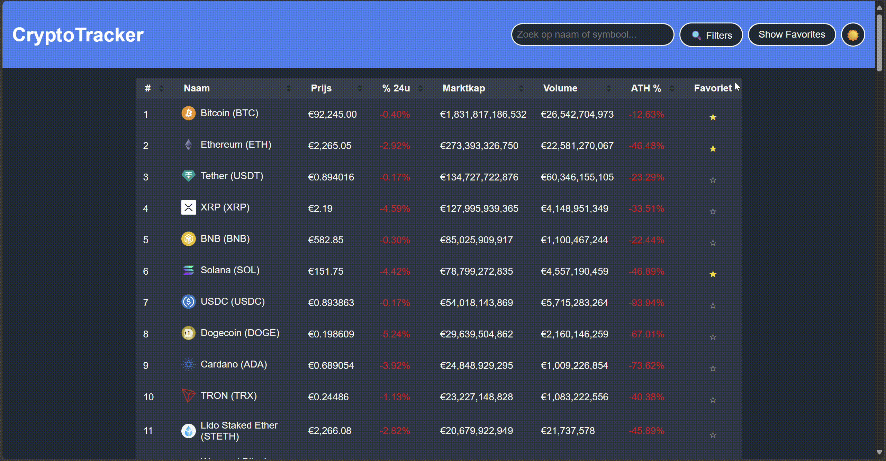

# CryptoTracker
Interactive Single Page Application for Web Advanced

## Projectbeschrijving
CryptoTracker is een interactieve single-page webapplicatie waarmee gebruikers live cryptocurrency-data kunnen verkennen, filteren, sorteren en opslaan in persoonlijke favorieten. De applicatie biedt een gebruiksvriendelijke interface en maakt gebruik van moderne webtechnologieën om een responsieve en aantrekkelijke gebruikerservaring te bieden.

## Gebruikte API + link
De applicatie maakt gebruik van de [CoinGecko API](https://www.coingecko.com/en/api) om live cryptocurrency-data op te halen (`src/js/api.js`). Deze API biedt uitgebreide informatie over cryptocurrencies, zoals prijzen, marktkapitalisatie, volume en meer.

## Voor elk technisch concept: waar en hoe toegepast
Hieronder een overzicht van de technische vereisten en waar deze in de code zijn toegepast:

### DOM Manipulatie
- **Elementen selecteren**: `document.querySelector` en `document.getElementById` worden gebruikt in `src/js/app.js` (o.a. voor knoppen, zoekbalk, tabel).
- **Elementen manipuleren**: Dynamische tabelrijen worden gegenereerd in `renderTable` en `createCryptoRow` in `src/js/render.js`.
- **Events aan elementen koppelen**: Event listeners worden toegevoegd aan sorteerheaders, filterknoppen, zoekbalk, favorietensterren, etc. in `src/js/app.js`.

### Modern JavaScript
- **Gebruik van constanten**: `const` wordt gebruikt voor vaste variabelen zoals `filterButton`, `applyFiltersButton` in `src/js/app.js`.
- **Template literals**: Gebruikt in `createCryptoRow` (`src/js/render.js`) voor dynamische HTML.
- **Iteratie over arrays**: `.forEach` wordt gebruikt in `renderTable` (`src/js/render.js`) en bij event listeners (`src/js/app.js`).
- **Array methodes**: `.filter`, `.sort` en `.map` worden gebruikt voor filtering en sortering van data in `src/js/filters.js`, `src/js/sorting.js`, en `src/js/app.js`.
- **Arrow functions**: Gebruikt in event listeners en array-methodes in vrijwel alle modules (`src/js/app.js`, `src/js/render.js`, etc.).
- **Conditional (ternary) operator**: Gebruikt in `createCryptoRow` (`src/js/render.js`) om te bepalen of een cryptocurrency een favoriet is.
- **Callback functions**: Gebruikt in array-methodes zoals `.filter` en `.sort` (`src/js/filters.js`, `src/js/sorting.js`).
- **Promises**: De CoinGecko API wordt aangeroepen met `fetch` en verwerkt met `.then` en `async/await` (`src/js/api.js`).
- **Async & Await**: Gebruikt in `displayCryptos` (`src/js/app.js`) en `fetchCryptoData` (`src/js/api.js`) om data op te halen van de API.
- **Observer API**: De **Intersection Observer API** wordt gebruikt in `src/js/observer.js` om te detecteren wanneer de tabel (`#crypto-table`) en de footer (`.footer-banner`) in beeld komen:
  - **Tabel**: Wanneer de tabel in beeld komt, wordt een visueel effect toegevoegd door de klasse `highlight` toe te voegen (`src/js/observer.js`).
  - **Footer**: Wanneer de footer in beeld komt, wordt een melding in de console weergegeven (`src/js/observer.js`).

### Data & API
- **Fetch om data op te halen**: Gebruikt in `fetchCryptoData` (`src/js/api.js`) en aangeroepen in `displayCryptos` (`src/js/app.js`).
- **JSON manipuleren en weergeven**: De API-respons wordt verwerkt en weergegeven in de tabel via `renderTable` (`src/js/render.js`).

### Opslag & validatie
- **Formulier validatie**: In `src/js/filters.js` wordt gecontroleerd of de ingevulde filterwaarden (zoals `marketCapMin`, `marketCapMax`, `priceChangeMin`, enz.) geldige getallen zijn voordat de filter wordt toegepast. Indien een veld leeg is, wordt een standaardwaarde gebruikt (bijvoorbeeld `0`, `Infinity` of `-Infinity`). Dit voorkomt fouten en zorgt ervoor dat alleen geldige filters worden toegepast.
- **Gebruik van LocalStorage**: Favorieten worden opgeslagen in `localStorage` en geladen bij het opstarten van de applicatie (`src/js/favorites.js`).

### Styling & layout
- **Basis HTML layout**: De applicatie maakt gebruik van een tabel om data weer te geven (`index.html`) en een modaal voor filters.
- **Basis CSS**: Stijlen zijn toegepast voor de tabel, knoppen en het filtermodaal (`src/css/style.css`).
- **Gebruiksvriendelijke elementen**: Knoppen hebben hover-effecten en de sorteerheaders tonen pijltjes om de sorteerstatus aan te geven (`index.html`, `src/css/style.css`).

### Tooling & structuur
- **Project opgezet met Vite**: Het project maakt gebruik van Vite voor snelle ontwikkeling (`package.json`).
- **Correcte folderstructuur**: HTML, CSS en JavaScript zijn gescheiden in de `src`-map. Modules: `app.js` (algemeen), `favorites.js` (favorietenbeheer), `filters.js` (filterlogica), `sorting.js` (sorteerlogica), `render.js` (rendering), `observer.js` (observer functionaliteit), `theme.js` (thema), `api.js` (API).

## Installatie-instructies
1. Clone de repository:
   ```bash
   git clone https://github.com/DarioDML/CryptoTracker
   ```
2. Navigeer naar de projectmap:
   ```bash
   cd Project_WebAdvanced
   ```
3. Installeer de benodigde dependencies:
   ```bash
   npm install
   ```
4. Start de ontwikkelserver:
   ```bash
   npm run dev
   ```
5. Open de applicatie in je browser via de link die Vite genereert.

## Screenshots
### Overzicht van de applicatie


### Filtermodaal


### Favorietenweergave


## Functionaliteit
### Zoekfunctie (GIF)


### Filterfunctie (GIF)


### Favorietfunctie (GIF)


## Gebruikte bronnen
- [CoinGecko API](https://www.coingecko.com/en/api)
- [MDN Web Docs](https://developer.mozilla.org/)
- [Vite](https://vitejs.dev/)
- [CSS Tricks](https://css-tricks.com/)
- [AI-assistentie via ChatGPT](https://chatgpt.com/share/680bc7e5-8874-8008-82f1-ebf3541bed9e)
- [AI-assistentie via GitHub Copilot 1](docs/CopilotChat1.md)
- [AI-assistentie via GitHub Copilot 2](docs/CopilotChat2.md)

